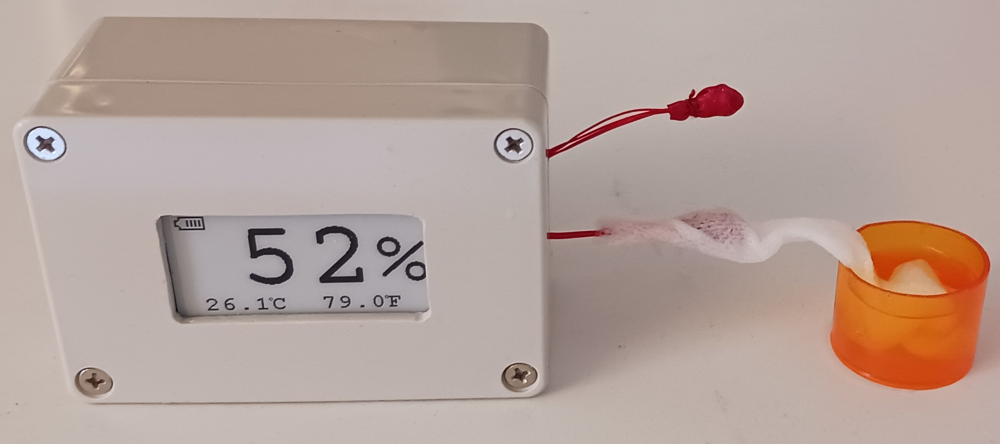
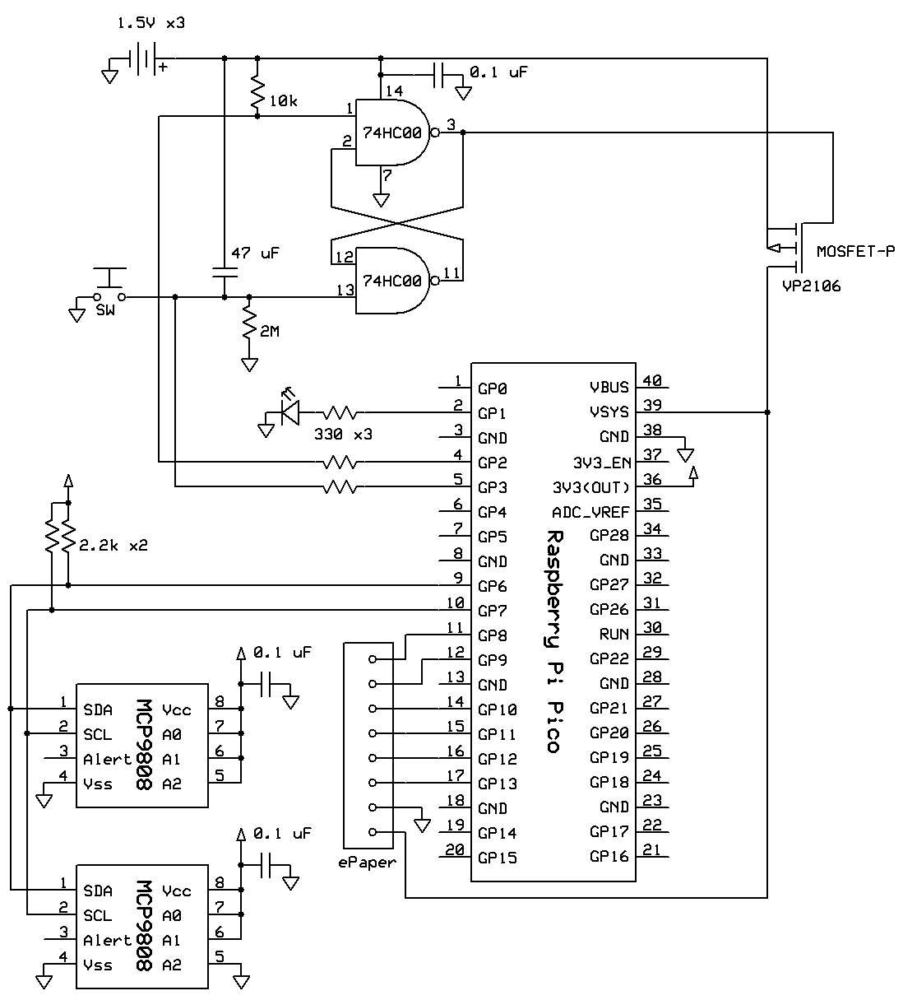
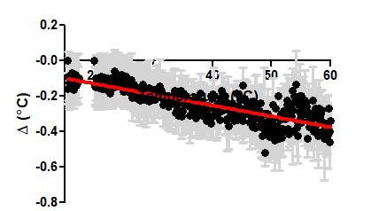

# pico_humidity_monitor
Humidity monitor using dry and wet thermometer bulbs.

## Feature
1. Made of Raspberry Pi Pico and Pico-ePaper-2.13.  
2. Accurate humidity moniter using dry and wet thermometer bulbs that are consists of MCP9808.  
3. Power saving circuit using intermittent operation and ePaper.  

## Circuit

## Calibration
Note that the calibration of MCP9808 chips are reqruied. Below is an example of calibration. In this case, two MCP9808 chips show shifted temperature (+/- 0.2 degree-C). Corrections are done in io.c. See the comments like 'Note "+0.1" here depends on each MCP9808 chip characteristic'.

## License
Some source codes are supplied under LGPL 2.1 license. Some codes are supplied under Waveshare license. See the comment of each file.
